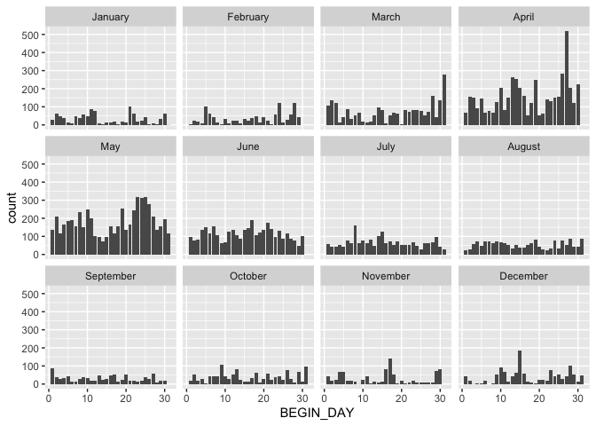
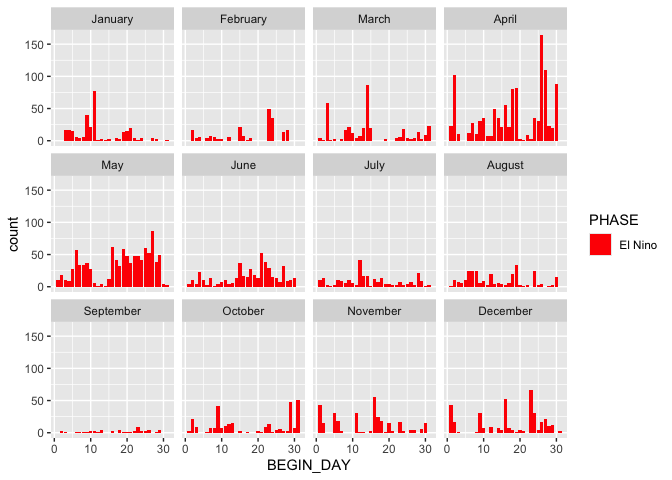
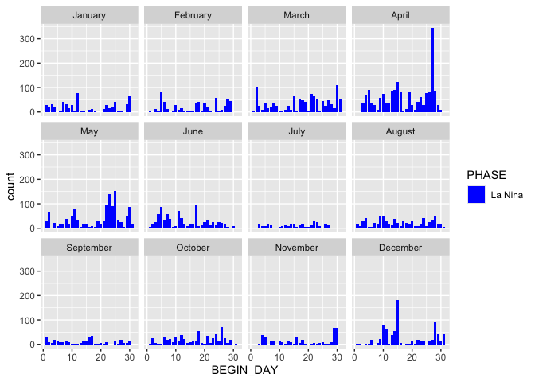
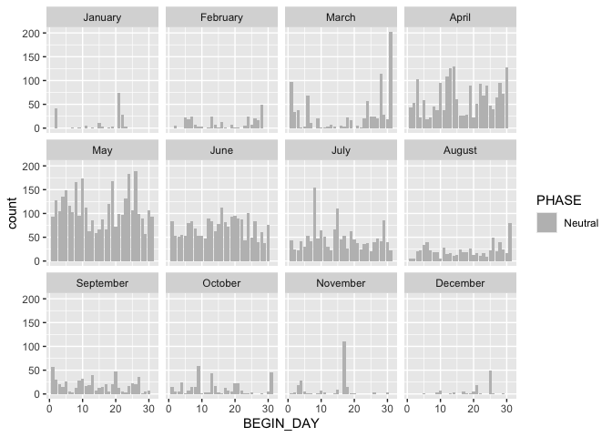
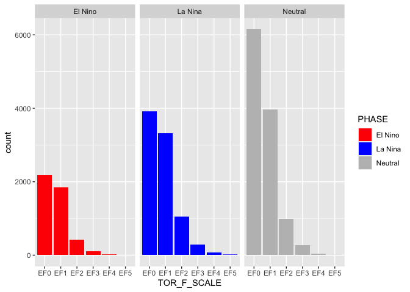
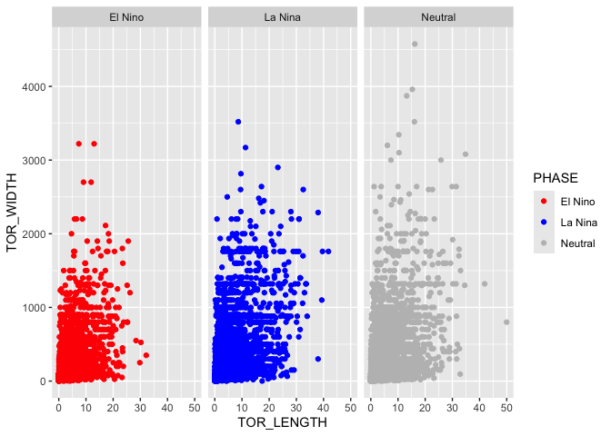
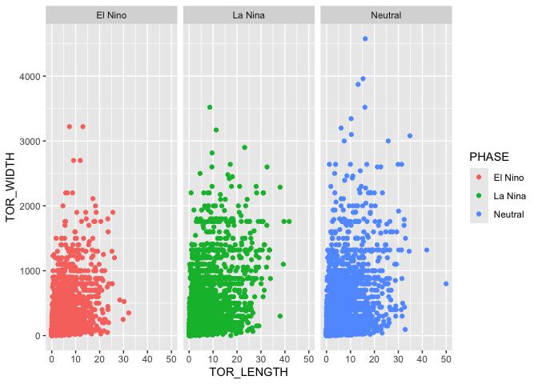

Project report
================
Vaughn Hendrix
2025-07-04

------------------------------------------------------------------------

## Introduction

The goal of this project is to explore the relationship between El Nino
Southern Oscillation (ENSO) and tornado formation in the United States.
ENSO is a global weather phenomenon located in the tropical pacific. It
is a recurring pattern in which warmer sea surface temperatures and
lower pressure shift between the east and west tropical pacific which
explains the “oscillation” in its name. Sea surface temperature
anomalies are explained in three phases: Neutral which is the average
temperature over a given number of years, El Niño phase which is warmer
temperatures than average in the eastern tropical pacific, while La Nina
is warmer than average temperatures in the western tropical pacific and
colder than average temperatures in the east tropical pacific.
Consequently, ENSO may provide the necessary conditions, such as moist
air, strong updrafts, and wind shear (the change in wind vector with
height), contributing to tornado formation.

The aim of this analysis is to determine if the phase of ENSO plays a
role in determining the frequency of tornadoes through the use of
various questions:

- Is there a trend in the appearance of tornadoes over the years? Does
  the phase of ENSO play a role in how many tornadoes are forming?

- Does the phase of ENSO shift the locations of tornadoes?

- How are the tornadoes themselves affected? Does their strength and
  size dependent on the phase of ENSO?

------------------------------------------------------------------------

## Data

#### Data Sources

My first data set comes from the NOAA Physical Sciences Laboratory:
ERSSTv5 Niño 3.4 Index, available at
[https://psl.noaa.gov/data/timeseries/month/](#0). The data set contains
two variables: the observation date and the corresponding ENSO value. It
provides monthly observations of sea surface temperature (sst) anomalies
from 1948-present, totaling 936 entries.

My tornado data comes from the National Centers for Environmental
Information (NCEI), available
at <https://www.ncei.noaa.gov/pub/data/swdi/stormevents/csvfiles/>. The
site provides CSV files containing storm details, fatalities, and
location information from 1950-present. I used the storm details data
sets, which include variables such as magnitude, intensity, event type,
date, and more. Each data set contains 51 variables and between 55,000
to 80,000 observations, depending on the year.

To explore the relationship between ENSO and tornado formation, I first
chose to use the nino3.4 index because it was a more general data set
covering characteristics in both the Central and Eastern Pacific
compared to others. Next, I analyzed 2007-2024 to see changes over time
and make the data set more manageable. Additionally, the Enhanced Fujita
(EF) scale was introduced in 2007 and limiting the time frame to begin
at 2007 keeps the tornado scaling consistent.

#### Data Cleaning

First, I imported the data through the CSV covering storm details from
2007 to 2024.

``` r
nino3.4 <- read_csv("nina34.anom.csv", show_col_types = FALSE)

tornadoes_2007 <- read_csv("StormDetails_2007.csv.gz", show_col_types = FALSE)
tornadoes_2008 <- read_csv("StormDetails_2008.csv.gz", show_col_types = FALSE)
tornadoes_2009 <- read_csv("StormDetails_2009.csv.gz", show_col_types = FALSE)
```

    ## Warning: One or more parsing issues, call `problems()` on your data frame for details,
    ## e.g.:
    ##   dat <- vroom(...)
    ##   problems(dat)

``` r
tornadoes_2010 <- read_csv("StormDetails_2010.csv.gz", show_col_types = FALSE)
tornadoes_2011 <- read_csv("StormDetails_2011.csv.gz", show_col_types = FALSE)
tornadoes_2012 <- read_csv("StormDetails_2012.csv.gz", show_col_types = FALSE)
```

    ## Warning: One or more parsing issues, call `problems()` on your data frame for details,
    ## e.g.:
    ##   dat <- vroom(...)
    ##   problems(dat)

``` r
tornadoes_2013 <- read_csv("StormDetails_2013.csv.gz", show_col_types = FALSE)
```

    ## Warning: One or more parsing issues, call `problems()` on your data frame for details,
    ## e.g.:
    ##   dat <- vroom(...)
    ##   problems(dat)

``` r
tornadoes_2014 <- read_csv("StormDetails_2014.csv.gz", show_col_types = FALSE)
```

    ## Warning: One or more parsing issues, call `problems()` on your data frame for details,
    ## e.g.:
    ##   dat <- vroom(...)
    ##   problems(dat)

``` r
tornadoes_2015 <- read_csv("StormDetails_2015.csv.gz", show_col_types = FALSE)
```

    ## Warning: One or more parsing issues, call `problems()` on your data frame for details,
    ## e.g.:
    ##   dat <- vroom(...)
    ##   problems(dat)

``` r
tornadoes_2016 <- read_csv("StormDetails_2016.csv.gz", show_col_types = FALSE)
tornadoes_2017 <- read_csv("StormDetails_2017.csv.gz", show_col_types = FALSE)
tornadoes_2018 <- read_csv("StormDetails_2018.csv.gz", show_col_types = FALSE)
tornadoes_2019 <- read_csv("StormDetails_2019.csv.gz", show_col_types = FALSE)
tornadoes_2020 <- read_csv("StormDetails_2020.csv.gz", show_col_types = FALSE)
tornadoes_2021 <- read_csv("StormDetails_2021.csv.gz", show_col_types = FALSE)
```

    ## Warning: One or more parsing issues, call `problems()` on your data frame for details,
    ## e.g.:
    ##   dat <- vroom(...)
    ##   problems(dat)

``` r
tornadoes_2022 <- read_csv("StormDetails_2022.csv.gz", show_col_types = FALSE)
tornadoes_2023 <- read_csv("StormDetails_2023.csv.gz", show_col_types = FALSE)
```

    ## Warning: One or more parsing issues, call `problems()` on your data frame for details,
    ## e.g.:
    ##   dat <- vroom(...)
    ##   problems(dat)

``` r
tornadoes_2024 <- read_csv("StormDetails_2024.csv.gz", show_col_types = FALSE)
#removed rows 31,35,36,37,39
```

Then, I changed one of the column names to enhance readability. I
filtered out ENSO values that were either `NA` or `-9999`, as both
represent invalid data. I then created a `BEGIN_YEARMONTH` column for
joining it with the main data set. A `YEAR` column was created to filter
for the years 2007 to 2024, and a `PHASE` column was added to label each
observation as either El Niño (value \> 0.5), La Nina (value \< -0.5),
or Neutral (−0.5 ≤ value ≤ 0.5).

``` r
colnames(nino3.4)[2] <- "nino3.4"

nino3.4 <- nino3.4 |> 
  filter(!is.na(Date), 
         !is.na(nino3.4),
         nino3.4 != -9999) |>
  mutate(BEGIN_YEARMONTH = as.numeric(format(Date, "%Y%m")), 
         YEAR = year(Date),
         PHASE = case_when(
           nino3.4 > 0.5 ~ "El Nino", 
           nino3.4 >= -0.5 & nino3.4 <= 0.5 ~ "Neutral", 
           nino3.4 < -0.5 ~ "La Nina", 
           TRUE ~ "Other" )) |>
  filter(YEAR >= 2007, YEAR < 2025)
nino3.4$PHASE <- factor(nino3.4$PHASE)
```

To simplify the process, I created a few functions to streamline the
workflow across all data sets. The first function filters the data to
include only tornado observations. The second function selects the
relevant variables from each data set. The final function uses a
dictionary to map the old tornado rating scale to the modern EF scale.
Since the data set contained both the older and modern rating system,
this function ensures consistency by converting the old ratings to the
modern scale.

``` r
tornado_obs <- function(data) {
  data <- data |> filter(EVENT_TYPE == "Tornado")
  return(data)
}

filtering_data <- function(data) {
  data <- data |> 
    select(BEGIN_YEARMONTH, BEGIN_DAY, STATE, YEAR, MONTH_NAME, EVENT_TYPE, BEGIN_DATE_TIME, END_DATE_TIME, DAMAGE_PROPERTY, TOR_F_SCALE, TOR_LENGTH, TOR_WIDTH, BEGIN_LAT, BEGIN_LON)
   return(data)
}

F_SCALE <- c("F0" = "EF0", "F1" = "EF1", "F2" = "EF2", "F3" = "EF3", "F4" = "EF4", "F5" = "EF5")

F_SCALE_EQUALIZATION <- function(data) {
  data <- data |>
    mutate(TOR_F_SCALE = ifelse(TOR_F_SCALE %in% names(F_SCALE), F_SCALE[TOR_F_SCALE] , TOR_F_SCALE))
   return(data)
}
```

``` r
tornadoes_2007 <- tornado_obs(tornadoes_2007)
tornadoes_2008 <- tornado_obs(tornadoes_2008)
tornadoes_2009 <- tornado_obs(tornadoes_2009)
tornadoes_2010 <- tornado_obs(tornadoes_2010)
tornadoes_2011 <- tornado_obs(tornadoes_2011)
tornadoes_2012 <- tornado_obs(tornadoes_2012)
tornadoes_2013 <- tornado_obs(tornadoes_2013)
tornadoes_2014 <- tornado_obs(tornadoes_2014)
tornadoes_2015 <- tornado_obs(tornadoes_2015)
tornadoes_2016 <- tornado_obs(tornadoes_2016)
tornadoes_2017 <- tornado_obs(tornadoes_2017)
tornadoes_2018 <- tornado_obs(tornadoes_2018)
tornadoes_2019 <- tornado_obs(tornadoes_2019)
tornadoes_2020 <- tornado_obs(tornadoes_2020)
tornadoes_2021 <- tornado_obs(tornadoes_2021)
tornadoes_2022 <- tornado_obs(tornadoes_2022)
tornadoes_2023 <- tornado_obs(tornadoes_2023)
tornadoes_2024 <- tornado_obs(tornadoes_2024)
```

``` r
tornadoes_2007 <- filtering_data(tornadoes_2007)
tornadoes_2008 <- filtering_data(tornadoes_2008)
tornadoes_2009 <- filtering_data(tornadoes_2009)
tornadoes_2010 <- filtering_data(tornadoes_2010)
tornadoes_2011 <- filtering_data(tornadoes_2011)
tornadoes_2012 <- filtering_data(tornadoes_2012)
tornadoes_2013 <- filtering_data(tornadoes_2013)
tornadoes_2014 <- filtering_data(tornadoes_2014)
tornadoes_2015 <- filtering_data(tornadoes_2015)
tornadoes_2016 <- filtering_data(tornadoes_2016)
tornadoes_2017 <- filtering_data(tornadoes_2017)
tornadoes_2018 <- filtering_data(tornadoes_2018)
tornadoes_2019 <- filtering_data(tornadoes_2019)
tornadoes_2020 <- filtering_data(tornadoes_2020)
tornadoes_2021 <- filtering_data(tornadoes_2021)
tornadoes_2022 <- filtering_data(tornadoes_2022)
tornadoes_2023 <- filtering_data(tornadoes_2023)
tornadoes_2024 <- filtering_data(tornadoes_2024)
```

``` r
tornadoes_2007 <- F_SCALE_EQUALIZATION(tornadoes_2007)
tornadoes_2008 <- F_SCALE_EQUALIZATION(tornadoes_2008)
tornadoes_2009 <- F_SCALE_EQUALIZATION(tornadoes_2009)
tornadoes_2010 <- F_SCALE_EQUALIZATION(tornadoes_2010)
tornadoes_2011 <- F_SCALE_EQUALIZATION(tornadoes_2011)
tornadoes_2012 <- F_SCALE_EQUALIZATION(tornadoes_2012)
tornadoes_2013 <- F_SCALE_EQUALIZATION(tornadoes_2013)
tornadoes_2014 <- F_SCALE_EQUALIZATION(tornadoes_2014)
tornadoes_2015 <- F_SCALE_EQUALIZATION(tornadoes_2015)
tornadoes_2016 <- F_SCALE_EQUALIZATION(tornadoes_2016)
tornadoes_2017 <- F_SCALE_EQUALIZATION(tornadoes_2017)
tornadoes_2018 <- F_SCALE_EQUALIZATION(tornadoes_2018)
tornadoes_2019 <- F_SCALE_EQUALIZATION(tornadoes_2019)
tornadoes_2020 <- F_SCALE_EQUALIZATION(tornadoes_2020)
tornadoes_2021 <- F_SCALE_EQUALIZATION(tornadoes_2021)
tornadoes_2022 <- F_SCALE_EQUALIZATION(tornadoes_2022)
tornadoes_2023 <- F_SCALE_EQUALIZATION(tornadoes_2023)
tornadoes_2024 <- F_SCALE_EQUALIZATION(tornadoes_2024)
```

To create the main data set, I used the `bind_rows()` function to merge
all tornado data frames from 2007 to 2024. I then converted the
`MONTH_NAME` column into a factor with levels ordered chronologically to
ensure the months appeared in the correct order.

``` r
masterData <- bind_rows(tornadoes_2007, tornadoes_2008, tornadoes_2009, tornadoes_2010, tornadoes_2011, tornadoes_2012, tornadoes_2013, tornadoes_2014, tornadoes_2015, tornadoes_2016, tornadoes_2017, tornadoes_2018, tornadoes_2019, tornadoes_2020, tornadoes_2021, tornadoes_2022, tornadoes_2023, tornadoes_2024)

masterData <- masterData |>
  mutate(MONTH_NAME = factor(MONTH_NAME, levels = c("January", "February", "March", "April", "May", "June", "July", "August", "September", "October", "November", "December")))
```

Finally, I used the `left_join()` function to merge the `masterData`
data set with the `nino3.4` data set, ensuring each tornado observation
included the corresponding ENSO value and phase.

``` r
masterData <- masterData |> left_join(nino3.4 |> select(nino3.4, BEGIN_YEARMONTH, PHASE), by = "BEGIN_YEARMONTH")
```

``` r
str(masterData)
```

    ## tibble [26,050 × 16] (S3: tbl_df/tbl/data.frame)
    ##  $ BEGIN_YEARMONTH: num [1:26050] 200706 200704 200704 200710 200705 ...
    ##  $ BEGIN_DAY      : num [1:26050] 1 15 15 22 15 24 13 13 4 13 ...
    ##  $ STATE          : chr [1:26050] "FLORIDA" "FLORIDA" "FLORIDA" "MISSISSIPPI" ...
    ##  $ YEAR           : num [1:26050] 2007 2007 2007 2007 2007 ...
    ##  $ MONTH_NAME     : Factor w/ 12 levels "January","February",..: 6 4 4 10 5 6 2 2 6 2 ...
    ##  $ EVENT_TYPE     : chr [1:26050] "Tornado" "Tornado" "Tornado" "Tornado" ...
    ##  $ BEGIN_DATE_TIME: chr [1:26050] "01-JUN-07 11:55:00" "15-APR-07 06:15:00" "15-APR-07 09:10:00" "22-OCT-07 16:54:00" ...
    ##  $ END_DATE_TIME  : chr [1:26050] "01-JUN-07 11:56:00" "15-APR-07 06:15:00" "15-APR-07 09:10:00" "22-OCT-07 16:59:00" ...
    ##  $ DAMAGE_PROPERTY: chr [1:26050] "20.00K" NA NA "180.00K" ...
    ##  $ TOR_F_SCALE    : chr [1:26050] "EF0" "EF2" "EF1" "EF1" ...
    ##  $ TOR_LENGTH     : num [1:26050] 0.55 1.5 0.2 3.47 0.15 ...
    ##  $ TOR_WIDTH      : num [1:26050] 30 300 50 150 30 30 200 60 200 40 ...
    ##  $ BEGIN_LAT      : num [1:26050] 24.7 30.5 29.7 33.4 40 ...
    ##  $ BEGIN_LON      : num [1:26050] -81.5 -82.2 -81.2 -90.5 -83.8 ...
    ##  $ nino3.4        : num [1:26050] -0.35 -0.32 -0.32 -1.39 -0.47 -0.35 0.13 0.13 -0.35 0.13 ...
    ##  $ PHASE          : Factor w/ 3 levels "El Nino","La Nina",..: 3 3 3 2 3 3 3 3 3 3 ...

#### Variables

- BEGIN_YEARMONTH (num): The year and month that the event began

- BEGIN_DAY (num): The day of the month that the event began

- STATE (chr): The state name where the event occurred

- YEAR (num): The year this event occured

- MONTH_NAME (Factor): The month this event occured

- EVENT_TYPE (chr): The classification of the observed storm (Tornado)

- BEGIN_DATE_TIME (chr): The date and time the event began

- END_DATE_TIME (chr): The date and time the event ended

- DAMAGE_PROPERTY (chr): The estimated amount of damage to property

- TOR_F_SCALE (chr): Strength of the tornado based on the amount and
  type of damage caused by the tornado

- TOR_LENGTH (num): Path length of the tornado when on the ground (in
  miles to the tenth)

- TOR_WIDTH (num): Width of the tornado or tornado segment while on the
  ground (in whole yards)

- BEGIN_LAT (num): The latitude in decimal degrees of the begin point of
  the event or damage path.

- BEGIN_LON (num): The longitude in decimal degrees of the begin point
  of the event or damage path.

- nino3.4 (num): The variation in sea surface temperature (SST) from
  long term average

- PHASE (Factor): The current ENSO phase

## Results

#### Is there a trend in the appearance of tornadoes over the years? Does the phase of ENSO play a role in how many tornadoes are forming?

``` r
trend <- masterData |> group_by(YEAR) |> summarise(count = n()) |> ungroup()
trend |> ggplot(aes(x = YEAR, y = count)) +
  geom_line() +
  scale_x_continuous(breaks = unique(masterData$YEAR), minor_breaks = NULL)
```

<!-- -->

This time series shows the number of tornadoes since 2007. This graph
shows a semi-periodic pattern, where it is common for a high to be
followed immediately by a low, with a standard distance being three
years. Recently, the trend for tornado appearance is on the rise, but
from the semi-periodic distribution, there could be a decline.

``` r
masterData |> 
  ggplot(aes(x = BEGIN_DAY)) + 
  geom_bar() +
  facet_wrap(~MONTH_NAME)
```

<!-- -->

This graph displays the daily tornado count throughout the year. It
shows that tornado activity typically peaks between April and June. In
addition to the semi-periodic trend observed across multiple years,
tornado activity within a single year also follows a seasonal pattern in
spring and early summer tornado spikes, then declines in the latter half
of the year. This seasonal peak could result from a southward dip in the
jet streak, providing strong wind shear along with increasing daylight
exposure and surface heating, creating good environments of instability.

``` r
masterData |> 
  filter(PHASE == "El Nino") |>
  ggplot(aes(x = BEGIN_DAY, fill = PHASE)) + 
  geom_bar() +
  facet_wrap(~MONTH_NAME) +
  scale_fill_manual(values = c("El Nino" = "red"))
```

<!-- -->

This graph displays the daily tornado count throughout the year, limited
to the El Nino phase, showing that tornado activity peaks in April and
May, with relatively little activity before or after. El Nino years
exhibit a noticeably shorter and more concentrated peak period compared
to the overall seasonal tornado peak from April to June.

``` r
masterData |> 
  filter(PHASE == "La Nina") |>
  ggplot(aes(x = BEGIN_DAY, fill = PHASE)) + 
  geom_bar() +
  facet_wrap(~MONTH_NAME) +
  scale_fill_manual(values = c("La Nina" = "blue"))
```

<!-- -->

This graph displays the daily tornado count throughout the year, limited
to the La Nina phase, showing that tornado activity shows an extended
peak from March through June, with relatively little activity before or
after. Compared to the overall tornado season, La Nina years exhibit a
longer and more active tornado period.

``` r
masterData |> 
  filter(PHASE == "Neutral") |>
  ggplot(aes(x = BEGIN_DAY, fill = PHASE)) + 
  geom_bar() +
  facet_wrap(~MONTH_NAME) +
  scale_fill_manual(values = c("Neutral" = "grey"))
```

<!-- -->

This graph displays the daily tornado count throughout the year, limited
to the Neutral phase. Similar to La Nina years, tornado activity during
the Neutral phase extends from April through July, indicating a longer
and more sustained tornado season.

#### Does the phase of ENSO shift the locations of tornadoes?

``` r
states <- map_data("state")
byState <- masterData |> group_by(STATE, PHASE) |> summarise(count = n(), .groups = "drop")
byState <- byState |> mutate(region = tolower(STATE)) |> select(-STATE)
tornado_map <- byState |> left_join(states, by = "region", relationship = "many-to-many")
```

``` r
tornado_map |>
  ggplot(aes(x = long, y = lat, fill = count)) +
  geom_polygon(aes(group = group)) +
  scale_fill_viridis_c(option = "viridis", na.value = "gray90") +
  labs(title = "Tornado Concentration by Phase") +
  facet_wrap(~PHASE)
```

<!-- -->

The following choropleth map of the United States shows the distribution
of tornado activity, where the shade of the state represents the number
of tornado observations. Across all three maps, it is common for
tornadoes to be observed in the Southern and Central Midwest, but the
range of activity varies depending on the phase. This specific activity
region could be attributed to the warm and moist air from the Gulf of
Mexico interacting with the cold and dry air of Canada which contribute
key variables in tornado formation.

It can be seen that the range of activity of El Nino shrinks in
comparison to the Neutral phase, being more limited towards the Southern
region. This is likely due to the jet stream, where after being shifted
southward by El Nino, creates a wetter and colder environment in the
South, thus a more stable environment. Unlike El Nino, La Nina range of
activity expands, covering more of the Midwestern region relative to the
number of observation in comparison to the Neutral phase. With the jet
stream moving polewards during La Nina, a larger area is warmer and
wetter, creating a more favorable condition for tornadoes.

#### How are the tornadoes themselves affected? Does their strength and size dependent on the phase of ENSO?

``` r
masterData |> mutate(DAMAGE_PROPERTY = substr(DAMAGE_PROPERTY, nchar(DAMAGE_PROPERTY), nchar(DAMAGE_PROPERTY))
) |> distinct(DAMAGE_PROPERTY)
```

    ## # A tibble: 4 × 1
    ##   DAMAGE_PROPERTY
    ##   <chr>          
    ## 1 K              
    ## 2 <NA>           
    ## 3 M              
    ## 4 B

``` r
masterData <- masterData |>
  mutate(DAMAGE_PROPERTY = case_when(
  substr(DAMAGE_PROPERTY, nchar(DAMAGE_PROPERTY), nchar(DAMAGE_PROPERTY)) == "K" ~ parse_number(DAMAGE_PROPERTY) * 10^3,
  substr(DAMAGE_PROPERTY, nchar(DAMAGE_PROPERTY), nchar(DAMAGE_PROPERTY)) == "M" ~ parse_number(DAMAGE_PROPERTY) * 10^6,
  substr(DAMAGE_PROPERTY, nchar(DAMAGE_PROPERTY), nchar(DAMAGE_PROPERTY)) == "B" ~ parse_number(DAMAGE_PROPERTY) * 10^9,
  is.na(DAMAGE_PROPERTY) ~ 0))
```

``` r
masterData |> 
  filter(DAMAGE_PROPERTY > 0) |>
  ggplot(aes(x = factor(PHASE), y = log(DAMAGE_PROPERTY))) +
  geom_boxplot() +
  stat_summary(fun = mean, geom = "point", shape = 20, size = 3, color = "red")
```

<!-- -->

This graph displays the distribution of the logarithm-transformed
property damage for each ENSO phase, with the red dots representing the
average damage. This visualization aimed to explore whether the ENSO
phase influences tornado-related property damage.

The box plots for each phase are very similar, showing only minor
differences in interquartile range and number of outliers. The El Nino
and Neutral phases have near identical distributions and averages, with
the Neutral phase having more extreme high-end outliers. La Nina,
however, was noticeable in having an increased median and average, along
with an upward-shifted range. While property damage is not the best
measurement in tornado strength, since other factors also play a role,
the data indicates that ENSO has little to no impact on tornado damage.

``` r
tornado_ranks <- masterData |> group_by(PHASE, TOR_F_SCALE) |> summarise(count = n()) |>  ungroup()
```

    ## `summarise()` has grouped output by 'PHASE'. You can override using the
    ## `.groups` argument.

``` r
tornado_ranks |> 
  filter(TOR_F_SCALE != "EFU") |>
  ggplot(aes(x = TOR_F_SCALE, y = count, fill = PHASE)) +
  geom_bar(stat = "identity") +
  facet_wrap(~PHASE)
```

<!-- -->

Another indicator of a tornado’s strength is its EF rating, which is
based on observed damage such as uprooted trees, destroyed roofs, etc.
This bar chart displays the distribution of tornado ratings since 2007
for each ENSO phase. Tornadoes with a rating of EFU (Enhanced Fujita
Unknown) have been excluded because there was insufficient information
to determine their rating.

All three ENSO phases display right-skewed distributions, with EF0 and
EF1 tornadoes being the most common. The distributions’ shapes are very
similar; however, La Nina stands out with relatively stronger tornadoes
compared to El Nino and Neutral. The shapes of El Nino and Neutral are
nearly identical, but El Nino is more likely to have EF0 and EF1
tornadoes. Unlike property damage, where ENSO had little to no
influence, the EF ratings show that La Nina is likelier to have stronger
tornadoes. In contrast, El Nino is likelier to have weaker ones.

``` r
masterData |> ggplot(aes(x = TOR_LENGTH, y = TOR_WIDTH, color = PHASE)) +
  geom_point()+
  facet_wrap(~PHASE)
```

<!-- -->

The final graph is a scatter plot displaying tornado width on the y-axis
and path length on the x-axis, with each point representing an
individual tornado observation. A pattern emerges across all three
phases where path length shows little variability while tornado width
shows greater variability. This likely reflects that certain local
conditions have a greater impact on tornado size, causing greater
variability. In contrast, tornado lifespan relies on certain conditions
being met, regardless of strength or size, leading to less variability.
Since the distribution shape for all three phases is nearly identical,
it suggests that ENSO does not have a meaningful impact on tornado size
and path length.

------------------------------------------------------------------------

## Conclusion

In conclusion, the analysis has revealed an evident relationship between
ENSO phases and tornado formation. Initially, I was aware that ENSO
impacted the jet stream, which could impact tornado activity, but I did
not know to what extent. I came in expecting that the impact on the jet
stream would greatly influence every aspect of tornado formation, but
that was not the case. Although there was a clear indication that El
Nino had an effect through noticeable changes in size and region of
activity compared to the Neutral phase, La Nina did not have as many
noticeable changes, indicating an influence compared to the Neutral
phase. One surprising observation was how little size and path length
were affected, as I thought a change in the jet stream would have a
larger influence than it did. But other factors, such as the activity
window, were more evident between the ENSO phases. Therefore, this
analysis has revealed that ENSO influences tornado formation and
activity, but many other factors also influence tornadoes.

Further research and analysis will be needed to explore how much of an
impact ENSO has on tornado formation and activity. Firstly, I would
balance the number of observations for each phase to help clarify the
individual impact, as one limitation to this analysis was that the
Neutral phase dominated the data set. Second, I would categorize the
full year as the dominant ENSO phase instead of working with the
individual months, as it created more noise in the dataset and made the
analysis more complex. Finally, it would be valuable to look into what
other phenomenon interacts with ENSO in tornado formation to better
isolate its specific impact.
