Project report
================
Vaughn Hendrix
2025-07-04

------------------------------------------------------------------------

### Introduction

The goal of this project is to explore the relationship between El Niño
Southern Oscillation (ENSO) and tornado formation in the United States.
ENSO is a global weather phenomenon located in the tropical pacific. It
is a recurring pattern in which warmer sea surface temperatures and
lower pressure shift between the east and west tropical pacific which
explains the “oscillation” in its name. Sea surface temperature
anomalies are explained in three phases: Neutral which is the average
temperature over a given number of years, El Niño phase which is warmer
temperatures than average in the eastern tropical pacific, while La Niña
is warmer than average temperatures in the western tropical pacific and
colder than average temperatures in the east tropical pacific.
Consequently, ENSO may provide the necessary conditions, such as moist
air, strong updrafts, and wind shear (the change in wind vector with
height), contributing to tornado formation.

The aim of this analysis is to determine if the phase of ENSO plays a
role in determining the frequency of tornadoes through the use of
various questions:

- Is there a trend in the appearance of tornadoes over the years? Does
  the phase of ENSO play a role in how many tornadoes are forming?

- Does the phase of ENSO shift the locations of tornadoes?

- How are the tornadoes themselves affected? Does their strength and
  size dependent on the phase of ENSO?

------------------------------------------------------------------------

### Data

My first data set comes from the NOAA Physical Sciences Laboratory:
ERSSTv5 Niño 3.4 Index, available at
<a href="#0" class="uri">https://psl.noaa.gov/data/timeseries/month/</a>.
The data set contains two variables: the date of observation and the
corresponding ENSO value. It provides monthly observations of sea
surface temperature (sst) anomalies from 1948 to the present, totaling
936 entries.

My tornado data comes from the National Centers for Environmental
Information (NCEI), available
at <https://www.ncei.noaa.gov/pub/data/swdi/stormevents/csvfiles/>. The
site provides CSV files containing storm details, fatalities, and
location information from 1950 to the present. I used the storm details
data sets, which include variables such as magnitude, intensity, event
type, date, and more. Each data set contains 51 variables and between
55,000 to 80,000 observations, depending on the year.

To explore the relationship between ENSO and tornado formation, I used
the Niño 3.4 index. Unlike other ENSO indexes, the Niño 3.4 index
captures characteristics of both Central and Eastern Pacific, making it
a more generalized measure. I then decided to analyze years 2007 to 2024
for all data sets. This allowed me to see changes over time while also
being manageable. Additionally, 2007 marks the introduction of the
Enhanced Fujita (EF) scale, ensuring consistency in tornado ratings
throughout the data set.

First, I imported the data through the CSV covering storm details from
2007 to 2024.

``` r
nino3.4 <- read_csv("nina34.anom.csv", show_col_types = FALSE)

tornadoes_2007 <- read_csv("StormDetails_2007.csv.gz", show_col_types = FALSE)
tornadoes_2008 <- read_csv("StormDetails_2008.csv.gz", show_col_types = FALSE)
tornadoes_2009 <- read_csv("StormDetails_2009.csv.gz", show_col_types = FALSE)
```

    ## Warning: One or more parsing issues, call `problems()` on your data frame for details,
    ## e.g.:
    ##   dat <- vroom(...)
    ##   problems(dat)

``` r
tornadoes_2010 <- read_csv("StormDetails_2010.csv.gz", show_col_types = FALSE)
tornadoes_2011 <- read_csv("StormDetails_2011.csv.gz", show_col_types = FALSE)
tornadoes_2012 <- read_csv("StormDetails_2012.csv.gz", show_col_types = FALSE)
```

    ## Warning: One or more parsing issues, call `problems()` on your data frame for details,
    ## e.g.:
    ##   dat <- vroom(...)
    ##   problems(dat)

``` r
tornadoes_2013 <- read_csv("StormDetails_2013.csv.gz", show_col_types = FALSE)
```

    ## Warning: One or more parsing issues, call `problems()` on your data frame for details,
    ## e.g.:
    ##   dat <- vroom(...)
    ##   problems(dat)

``` r
tornadoes_2014 <- read_csv("StormDetails_2014.csv.gz", show_col_types = FALSE)
```

    ## Warning: One or more parsing issues, call `problems()` on your data frame for details,
    ## e.g.:
    ##   dat <- vroom(...)
    ##   problems(dat)

``` r
tornadoes_2015 <- read_csv("StormDetails_2015.csv.gz", show_col_types = FALSE)
```

    ## Warning: One or more parsing issues, call `problems()` on your data frame for details,
    ## e.g.:
    ##   dat <- vroom(...)
    ##   problems(dat)

``` r
tornadoes_2016 <- read_csv("StormDetails_2016.csv.gz", show_col_types = FALSE)
tornadoes_2017 <- read_csv("StormDetails_2017.csv.gz", show_col_types = FALSE)
tornadoes_2018 <- read_csv("StormDetails_2018.csv.gz", show_col_types = FALSE)
tornadoes_2019 <- read_csv("StormDetails_2019.csv.gz", show_col_types = FALSE)
tornadoes_2020 <- read_csv("StormDetails_2020.csv.gz", show_col_types = FALSE)
tornadoes_2021 <- read_csv("StormDetails_2021.csv.gz", show_col_types = FALSE)
```

    ## Warning: One or more parsing issues, call `problems()` on your data frame for details,
    ## e.g.:
    ##   dat <- vroom(...)
    ##   problems(dat)

``` r
tornadoes_2022 <- read_csv("StormDetails_2022.csv.gz", show_col_types = FALSE)
tornadoes_2023 <- read_csv("StormDetails_2023.csv.gz", show_col_types = FALSE)
```

    ## Warning: One or more parsing issues, call `problems()` on your data frame for details,
    ## e.g.:
    ##   dat <- vroom(...)
    ##   problems(dat)

``` r
tornadoes_2024 <- read_csv("StormDetails_2024.csv.gz", show_col_types = FALSE)
#removed rows 31,35,36,37,39
```

Then, I changed one of the column names to enhance readability. I
filtered out ENSO values that were either `NA` or `-9999`, as both
represent invalid data. I then created a `BEGIN_YEARMONTH` column for
joining it with the main data set. A `YEAR` column was created to filter
for the years 2007 to 2024, and a `PHASE` column was added to label each
observation as either El Niño (value \> 0.5), La Niña (value \< -0.5),
or Neutral (−0.5 ≤ value ≤ 0.5).

``` r
colnames(nino3.4)[2] <- "nino3.4"

nino3.4 <- nino3.4 |> 
  filter(!is.na(Date), 
         !is.na(nino3.4),
         nino3.4 != -9999) |>
  mutate(BEGIN_YEARMONTH = as.numeric(format(Date, "%Y%m")), 
         YEAR = year(Date),
         PHASE = case_when(
           nino3.4 > 0.5 ~ "El Nino", 
           nino3.4 >= -0.5 & nino3.4 <= 0.5 ~ "Neutral", 
           nino3.4 < -0.5 ~ "La Nina", 
           TRUE ~ "Other" )) |>
  filter(YEAR >= 2007, YEAR < 2025)
nino3.4$PHASE <- factor(nino3.4$PHASE)
```

To simplify the process, I created a few functions to streamline the
workflow across all data sets. The first function filters the data to
include only tornado observations. The second function selects the
relevant variables from each data set. The final function uses a
dictionary to map the old tornado rating scale to the modern EF scale.
Since the data set contained both the older and modern rating system,
this function ensures consistency by converting the old ratings to the
modern scale.

``` r
tornado_obs <- function(data) {
  data <- data |> filter(EVENT_TYPE == "Tornado")
  return(data)
}

filtering_data <- function(data) {
  data <- data |> 
    select(BEGIN_YEARMONTH, BEGIN_DAY, STATE, YEAR, MONTH_NAME, EVENT_TYPE, BEGIN_DATE_TIME, END_DATE_TIME, DAMAGE_PROPERTY, TOR_F_SCALE, TOR_LENGTH, TOR_WIDTH, BEGIN_LAT, BEGIN_LON)
   return(data)
}

F_SCALE <- c("F0" = "EF0", "F1" = "EF1", "F2" = "EF2", "F3" = "EF3", "F4" = "EF4", "F5" = "EF5")

F_SCALE_EQUALIZATION <- function(data) {
  data <- data |>
    mutate(TOR_F_SCALE = ifelse(TOR_F_SCALE %in% names(F_SCALE), F_SCALE[TOR_F_SCALE] , TOR_F_SCALE))
   return(data)
}
```

``` r
tornadoes_2007 <- tornado_obs(tornadoes_2007)
tornadoes_2008 <- tornado_obs(tornadoes_2008)
tornadoes_2009 <- tornado_obs(tornadoes_2009)
tornadoes_2010 <- tornado_obs(tornadoes_2010)
tornadoes_2011 <- tornado_obs(tornadoes_2011)
tornadoes_2012 <- tornado_obs(tornadoes_2012)
tornadoes_2013 <- tornado_obs(tornadoes_2013)
tornadoes_2014 <- tornado_obs(tornadoes_2014)
tornadoes_2015 <- tornado_obs(tornadoes_2015)
tornadoes_2016 <- tornado_obs(tornadoes_2016)
tornadoes_2017 <- tornado_obs(tornadoes_2017)
tornadoes_2018 <- tornado_obs(tornadoes_2018)
tornadoes_2019 <- tornado_obs(tornadoes_2019)
tornadoes_2020 <- tornado_obs(tornadoes_2020)
tornadoes_2021 <- tornado_obs(tornadoes_2021)
tornadoes_2022 <- tornado_obs(tornadoes_2022)
tornadoes_2023 <- tornado_obs(tornadoes_2023)
tornadoes_2024 <- tornado_obs(tornadoes_2024)
```

``` r
tornadoes_2007 <- filtering_data(tornadoes_2007)
tornadoes_2008 <- filtering_data(tornadoes_2008)
tornadoes_2009 <- filtering_data(tornadoes_2009)
tornadoes_2010 <- filtering_data(tornadoes_2010)
tornadoes_2011 <- filtering_data(tornadoes_2011)
tornadoes_2012 <- filtering_data(tornadoes_2012)
tornadoes_2013 <- filtering_data(tornadoes_2013)
tornadoes_2014 <- filtering_data(tornadoes_2014)
tornadoes_2015 <- filtering_data(tornadoes_2015)
tornadoes_2016 <- filtering_data(tornadoes_2016)
tornadoes_2017 <- filtering_data(tornadoes_2017)
tornadoes_2018 <- filtering_data(tornadoes_2018)
tornadoes_2019 <- filtering_data(tornadoes_2019)
tornadoes_2020 <- filtering_data(tornadoes_2020)
tornadoes_2021 <- filtering_data(tornadoes_2021)
tornadoes_2022 <- filtering_data(tornadoes_2022)
tornadoes_2023 <- filtering_data(tornadoes_2023)
tornadoes_2024 <- filtering_data(tornadoes_2024)
```

``` r
tornadoes_2007 <- F_SCALE_EQUALIZATION(tornadoes_2007)
tornadoes_2008 <- F_SCALE_EQUALIZATION(tornadoes_2008)
tornadoes_2009 <- F_SCALE_EQUALIZATION(tornadoes_2009)
tornadoes_2010 <- F_SCALE_EQUALIZATION(tornadoes_2010)
tornadoes_2011 <- F_SCALE_EQUALIZATION(tornadoes_2011)
tornadoes_2012 <- F_SCALE_EQUALIZATION(tornadoes_2012)
tornadoes_2013 <- F_SCALE_EQUALIZATION(tornadoes_2013)
tornadoes_2014 <- F_SCALE_EQUALIZATION(tornadoes_2014)
tornadoes_2015 <- F_SCALE_EQUALIZATION(tornadoes_2015)
tornadoes_2016 <- F_SCALE_EQUALIZATION(tornadoes_2016)
tornadoes_2017 <- F_SCALE_EQUALIZATION(tornadoes_2017)
tornadoes_2018 <- F_SCALE_EQUALIZATION(tornadoes_2018)
tornadoes_2019 <- F_SCALE_EQUALIZATION(tornadoes_2019)
tornadoes_2020 <- F_SCALE_EQUALIZATION(tornadoes_2020)
tornadoes_2021 <- F_SCALE_EQUALIZATION(tornadoes_2021)
tornadoes_2022 <- F_SCALE_EQUALIZATION(tornadoes_2022)
tornadoes_2023 <- F_SCALE_EQUALIZATION(tornadoes_2023)
tornadoes_2024 <- F_SCALE_EQUALIZATION(tornadoes_2024)
```

To create the main data set, I used the `bind_rows()` function to merge
all tornado data frames from 2007 to 2024. I then converted the
`MONTH_NAME` column into a factor with levels ordered chronologically to
ensure the months appeared in the correct order.

``` r
masterData <- bind_rows(tornadoes_2007, tornadoes_2008, tornadoes_2009, tornadoes_2010, tornadoes_2011, tornadoes_2012, tornadoes_2013, tornadoes_2014, tornadoes_2015, tornadoes_2016, tornadoes_2017, tornadoes_2018, tornadoes_2019, tornadoes_2020, tornadoes_2021, tornadoes_2022, tornadoes_2023, tornadoes_2024)

masterData <- masterData |>
  mutate(MONTH_NAME = factor(MONTH_NAME, levels = c("January", "February", "March", "April", "May", "June", "July", "August", "September", "October", "November", "December")))
```

Finally, I used the `left_join()` function to merge the `masterData`
data set with the `nino3.4` data set, ensuring each tornado observation
included the corresponding ENSO value and phase.

``` r
masterData <- masterData |> left_join(nino3.4 |> select(nino3.4, BEGIN_YEARMONTH, PHASE), by = "BEGIN_YEARMONTH")
```

------------------------------------------------------------------------

### Results

#### Is there a trend in the appearance of tornadoes over the years? Does the phase of ENSO play a role in how many tornadoes are forming?

``` r
masterData |> ggplot(aes(x = BEGIN_DAY)) + 
  geom_bar() +
  facet_wrap(~MONTH_NAME)
```

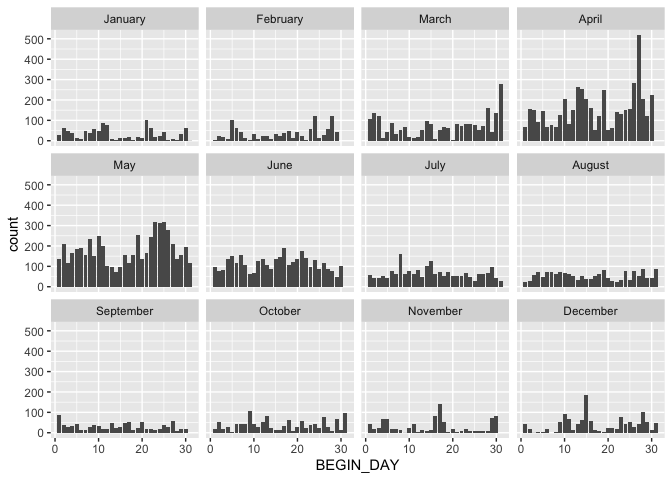<!-- -->

``` r
masterData |> 
  filter(PHASE == "Neutral") |>
  ggplot(aes(x = MONTH_NAME)) + 
  geom_bar() +
  facet_wrap(~YEAR, ncol = 6) +
  theme(axis.text.x = element_text(angle = 90, vjust = 0.5, hjust = 1, size = 5))
```

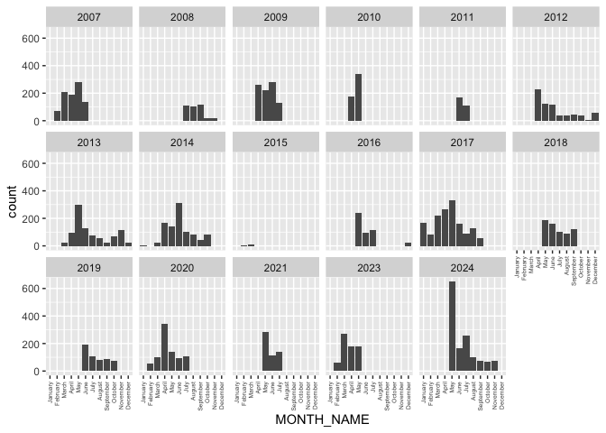<!-- -->

``` r
masterData |> 
  filter(PHASE == "El Nino") |>
  ggplot(aes(x = MONTH_NAME)) + 
  geom_bar() +
  facet_wrap(~YEAR, ncol = 6) +
  theme(axis.text.x = element_text(angle = 90, vjust = 0.5, hjust = 1, size = 5))
```

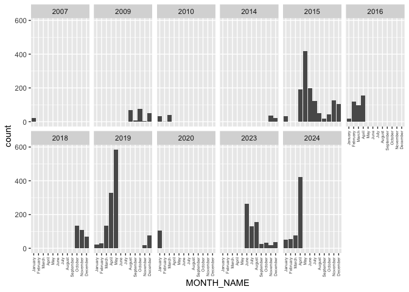<!-- -->

``` r
masterData |> 
  filter(PHASE == "La Nina") |>
  ggplot(aes(x = MONTH_NAME)) + 
  geom_bar() +
  facet_wrap(~YEAR, ncol = 6) +
  theme(axis.text.x = element_text(angle = 90, vjust = 0.5, hjust = 1, size = 5))
```

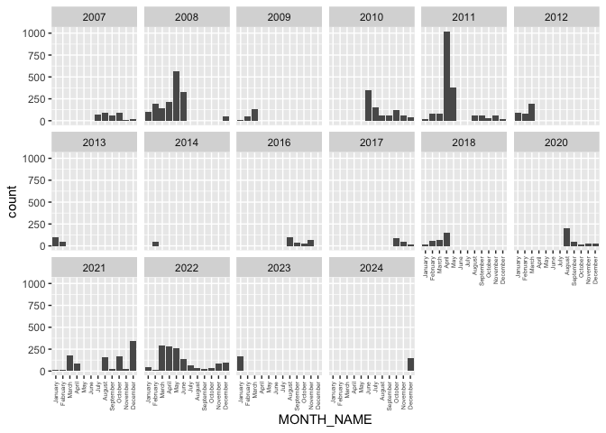<!-- -->

``` r
masterData |> 
  group_by(YEAR) |> 
  summarise(count = n()) |> 
  ggplot(aes(x = YEAR, y = count)) + 
  geom_line() + 
  scale_x_continuous(breaks = unique(masterData$YEAR), minor_breaks = NULL)
```

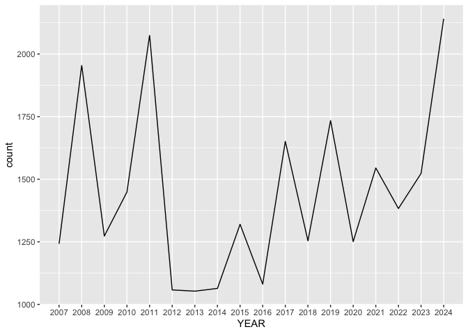<!-- -->

``` r
nino3.4 |> ggplot(aes(x = Date, y = nino3.4)) + 
  geom_line() +
  annotate("rect", xmin = as.Date("2006-12-01"), xmax = as.Date("2025-01-01"), ymin = -Inf, ymax = -0.5,
           alpha = 0.2, fill = "blue") +
  annotate("rect", xmin = as.Date("2006-12-01"), xmax = as.Date("2025-01-01"), ymin = 0.5, ymax = Inf,
           alpha = 0.2, fill = "red")
```

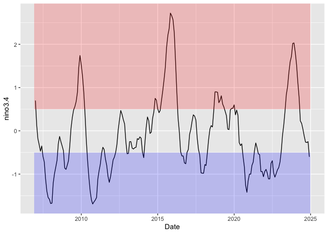<!-- -->

``` r
masterData |> 
  group_by(YEAR, PHASE) |> 
  summarise(count = n()) |> 
  ggplot(aes(x = YEAR, y = count, group = PHASE, color = PHASE)) +
  geom_line() +
  scale_color_manual(values = c("El Nino" = "red", "La Nina" = "blue", "Neutral" = "gray"))
```

    ## `summarise()` has grouped output by 'YEAR'. You can override using the
    ## `.groups` argument.

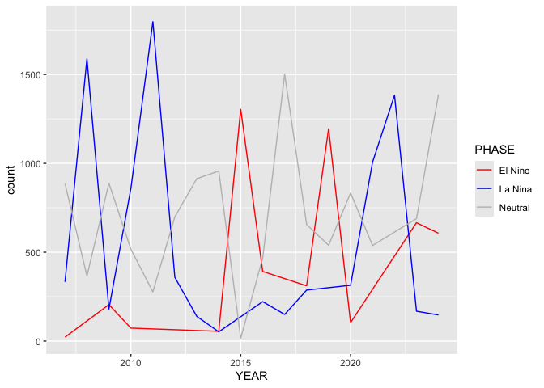<!-- -->

``` r
masterData |> 
  mutate(BEGIN_DAY = as.integer(BEGIN_DAY), PHASE = factor(PHASE)) |> 
  ggplot(aes(x = BEGIN_DAY, fill = PHASE)) + 
  geom_bar(position = position_dodge(preserve = "single")) +
  facet_wrap(~MONTH_NAME, ncol = 4)
```

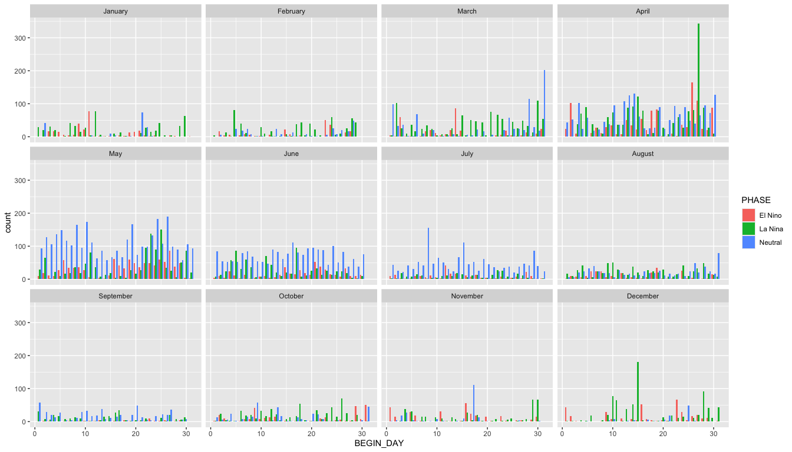<!-- -->

``` r
masterData |> 
  group_by(YEAR, PHASE) |> 
  summarise(count = n()) |> 
  ggplot(aes(x = YEAR, y = count, group = PHASE, color = PHASE)) +
  geom_line() +
  scale_color_manual(values = c("El Nino" = "red", "La Nina" = "blue", "Neutral" = "gray"))
```

    ## `summarise()` has grouped output by 'YEAR'. You can override using the
    ## `.groups` argument.

<!-- -->

``` r
str(masterData)
```

    ## tibble [26,050 × 16] (S3: tbl_df/tbl/data.frame)
    ##  $ BEGIN_YEARMONTH: num [1:26050] 200706 200704 200704 200710 200705 ...
    ##  $ BEGIN_DAY      : num [1:26050] 1 15 15 22 15 24 13 13 4 13 ...
    ##  $ STATE          : chr [1:26050] "FLORIDA" "FLORIDA" "FLORIDA" "MISSISSIPPI" ...
    ##  $ YEAR           : num [1:26050] 2007 2007 2007 2007 2007 ...
    ##  $ MONTH_NAME     : Factor w/ 12 levels "January","February",..: 6 4 4 10 5 6 2 2 6 2 ...
    ##  $ EVENT_TYPE     : chr [1:26050] "Tornado" "Tornado" "Tornado" "Tornado" ...
    ##  $ BEGIN_DATE_TIME: chr [1:26050] "01-JUN-07 11:55:00" "15-APR-07 06:15:00" "15-APR-07 09:10:00" "22-OCT-07 16:54:00" ...
    ##  $ END_DATE_TIME  : chr [1:26050] "01-JUN-07 11:56:00" "15-APR-07 06:15:00" "15-APR-07 09:10:00" "22-OCT-07 16:59:00" ...
    ##  $ DAMAGE_PROPERTY: chr [1:26050] "20.00K" NA NA "180.00K" ...
    ##  $ TOR_F_SCALE    : chr [1:26050] "EF0" "EF2" "EF1" "EF1" ...
    ##  $ TOR_LENGTH     : num [1:26050] 0.55 1.5 0.2 3.47 0.15 ...
    ##  $ TOR_WIDTH      : num [1:26050] 30 300 50 150 30 30 200 60 200 40 ...
    ##  $ BEGIN_LAT      : num [1:26050] 24.7 30.5 29.7 33.4 40 ...
    ##  $ BEGIN_LON      : num [1:26050] -81.5 -82.2 -81.2 -90.5 -83.8 ...
    ##  $ nino3.4        : num [1:26050] -0.35 -0.32 -0.32 -1.39 -0.47 -0.35 0.13 0.13 -0.35 0.13 ...
    ##  $ PHASE          : Factor w/ 3 levels "El Nino","La Nina",..: 3 3 3 2 3 3 3 3 3 3 ...

## Does the phase of ENSO shift the locations of tornadoes?

``` r
states <- map_data("state")
byState <- masterData |> group_by(STATE, PHASE) |> summarise(count = n(), .groups = "drop")
byState <- byState |> mutate(region = tolower(STATE)) |> select(-STATE)
tornado_map <- byState |> left_join(states, by = "region", relationship = "many-to-many")
```

``` r
tornado_map |>
  ggplot(aes(x = long, y = lat, fill = count)) +
  geom_polygon(aes(group = group)) +
  scale_fill_viridis_c(option = "viridis", na.value = "gray90") +
  labs(title = "Tornado Concentration by Phase") +
  facet_wrap(~PHASE)
```

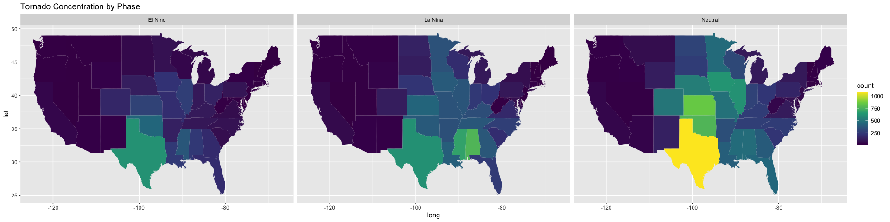<!-- -->

The following graph is a choropleth map of the United States, where the
shade of each state represents the number of tornado observations.
Across all three ENSO phases, tornadoes are most commonly observed in
the Southern and Central Midwest, where warm, moist air from the Gulf of
Mexico meets cold, dry air from Canada, creating an unstable atmosphere
favorable for tornado formation.

However, the maps show that ENSO does have an influence on the
geographic distribution of tornado activity. In the El Niño map, the
region of tornado activity shrinks, becoming more clustered in the
southern U.S. This is likely due to the impact of ENSO on the jet
stream, where El Niño shifts the jet stream southward, making the
Southern region wetter and colder, thus reducing unstable conditions in
the Central Midwest that were previously caused by the warmer Southern
region. Tornadoes still form because moist air is still supplied by the
Gulf of Mexico and wind shear from the jet stream, but tornado activity
reduces and the active region shrinks.

In contrast, La Niña expands the region of tornado activity. Similar to
El Niño, the jet stream shifts, but this time poleward, causing a larger
area of warm and wet conditions, increasing favorable conditions for
tornado formation.

## How are the tornadoes themselves affected? Does their strength and size dependent on the phase of ENSO?

``` r
masterData |> mutate(DAMAGE_PROPERTY = substr(DAMAGE_PROPERTY, nchar(DAMAGE_PROPERTY), nchar(DAMAGE_PROPERTY))
) |> distinct(DAMAGE_PROPERTY)
```

    ## # A tibble: 4 × 1
    ##   DAMAGE_PROPERTY
    ##   <chr>          
    ## 1 K              
    ## 2 <NA>           
    ## 3 M              
    ## 4 B

``` r
masterData <- masterData |>
  mutate(DAMAGE_PROPERTY = case_when(
  substr(DAMAGE_PROPERTY, nchar(DAMAGE_PROPERTY), nchar(DAMAGE_PROPERTY)) == "K" ~ parse_number(DAMAGE_PROPERTY) * 10^3,
  substr(DAMAGE_PROPERTY, nchar(DAMAGE_PROPERTY), nchar(DAMAGE_PROPERTY)) == "M" ~ parse_number(DAMAGE_PROPERTY) * 10^6,
  substr(DAMAGE_PROPERTY, nchar(DAMAGE_PROPERTY), nchar(DAMAGE_PROPERTY)) == "B" ~ parse_number(DAMAGE_PROPERTY) * 10^9,
  is.na(DAMAGE_PROPERTY) ~ 0))
```

``` r
masterData |> 
  filter(DAMAGE_PROPERTY > 0) |>
  ggplot(aes(x = factor(PHASE), y = log(DAMAGE_PROPERTY))) +
  geom_boxplot() +
  stat_summary(fun = mean, geom = "point", shape = 20, size = 3, color = "red")
```

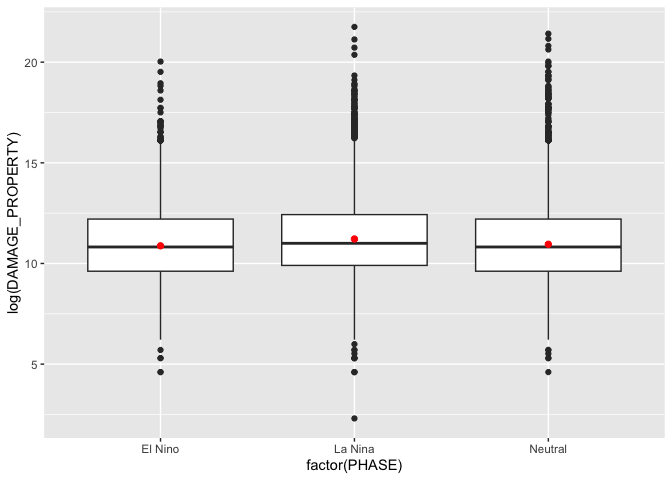<!-- -->

This graph displays the distribution of the logarithm transformed
property damage for each ENSO phase, with the red dots representing the
average damage. The purpose of this visualization was to explore whether
ENSO phase influences tornado related property damage.

The box plots for each phase are very similar, showing only minor
differences in interquartile range and number of outliers. The El Nino
and Neutral phase have near identical distribution and average, with the
Neutral ophase having more extreme high end outliers. La Nina, however,
was noticeable in having an increased median and average, along with an
upward shifted range. While property damage is not the best measurement
in tornado strength, since other factors also play a role, the data
indicates that ENSO has little to no impact on tornado damage.

``` r
tornado_ranks <- masterData |> group_by(PHASE, TOR_F_SCALE) |> summarise(count = n()) |>  ungroup()
```

    ## `summarise()` has grouped output by 'PHASE'. You can override using the
    ## `.groups` argument.

``` r
tornado_ranks |> 
  filter(TOR_F_SCALE != "EFU") |>
  ggplot(aes(x = TOR_F_SCALE, y = count, fill = PHASE)) +
  geom_bar(stat = "identity") +
  facet_wrap(~PHASE)
```

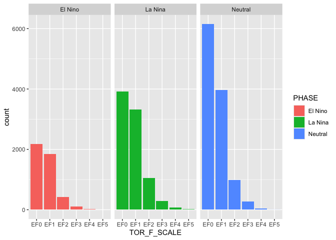<!-- -->

Another indicator of a tornado’s strength is its EF rating, which is
based on observed damage such as uprooted trees, destroyed roofs, and
structural collapse. This bar chart displays the distribution of tornado
ratings since 2007 for each ENSO phase. Tornado’s with a rating of EFU
(Enhanced Fujita Unknown) have been excluded, because there was
insufficient information to determine its rating.

All three ENSO phases display right skewed distribition with EF0 and EF1
tornadoes being the most common. The shapes of the distributions are
very similar to each other, however, La Nina stands out with relatively
more stronger tornadoes compared to El Nino and Neutral. The shapes of
El Nino and Neutral are nearly identical, but El Nino is more likely to
have EF0 and EF1 tornadoes. Unlike property damage where ENSO had little
to no influence, the EF ratings show that La Nina is more likely to have
stronger tornadoes while El Nino is more likely to have weaker
tornadoes.

``` r
masterData |> ggplot(aes(x = TOR_LENGTH, y = TOR_WIDTH, color = PHASE)) +
  geom_point()+
  facet_wrap(~PHASE)
```

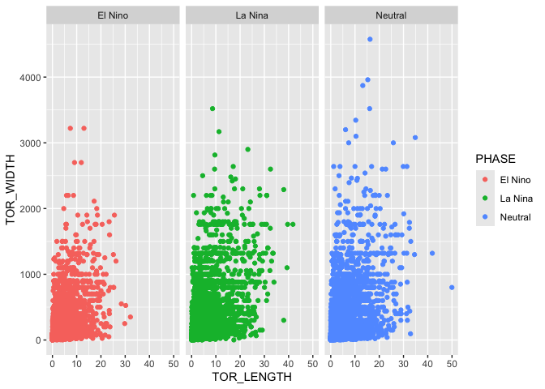<!-- -->

The final graph is a scatter plot displaying tornado width on the y-axis
and path length on the x-axis, with each point representing an
individual tornado observation. A pattern emerges across all three
phases where path length shows little variability while tornado width
shows greater variability. This likely reflects that certain local
conditions have greater impact on tornado size causing greater
variability. In contrast, tornado lifespan is reliant on certain
conditions being met regardless of strength or size leading to less
variability. Since the shape of distribution for all three phases are
nearly identical, it suggests that ENSO does not have a meaningful
impact on tornado size and path length.

------------------------------------------------------------------------

## Conclusion

we did… we found…
